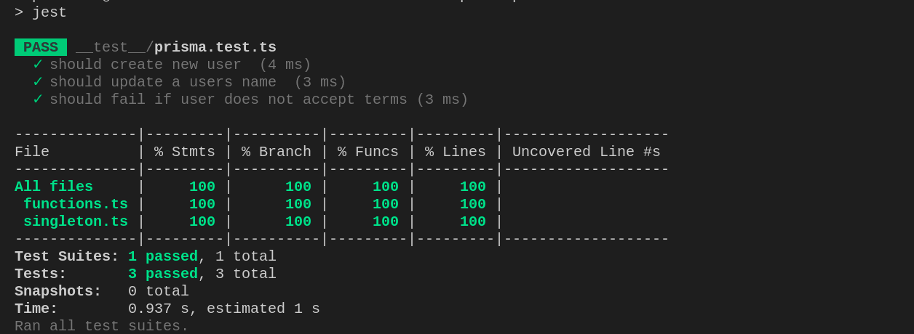

# Prisma Singleton mock Expressjs with database testing

This is a simple implementation of mocking database tests without hitting the database
This is necessary and handy when testing functionalities of your application

To get started with the project

- Nodejs
- Expressjs
- SQLite
- Jest

Run
```sh
<npm|pnpm|yarn> install 
```
Then initialize your db
```sh
npx prisma init --datasource-provider sqlite
```
Make initial migrations
```sh
npx prisma migrate dev --name init
```

You can use the prisma studio to visualize the models defined
```sh
npx prisma studio
```
To run tour tests just run
```sh
npm run test
```
